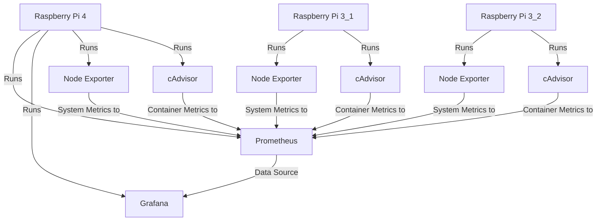

# Raspberry Pi Monitoring Playground

## Introduction

Over the weekend, I dabbled in setting up a monitoring solution for Raspberry Pis, and I thought it'd be great to share what I've learned and accomplished. If you're interested in leveraging Grafana, Prometheus, Node Exporter, and cAdvisor for your own monitoring needs, you've come to the right place!

## Table of Contents

- [Raspberry Pi Monitoring Playground](#raspberry-pi-monitoring-playground)
  - [Introduction](#introduction)
  - [Table of Contents](#table-of-contents)
    - [Overview of Services](#overview-of-services)
    - [System Architecture](#system-architecture)
  - [Install Docker](#install-docker)
  - [Setup Docker-Compose](#setup-docker-compose)
  - [Running Grafana in Docker](#running-grafana-in-docker)
  - [Node Exporter Setup](#node-exporter-setup)
  - [Prometheus Setup](#prometheus-setup)
  - [cAdvisor Setup](#cadvisor-setup)
  - [Final Docker-Compose File](#final-docker-compose-file)
  - [Debugging Notes](#debugging-notes)

### Overview of Services

1. **Grafana**: A powerful open-source platform for monitoring and observability. Grafana allows you to visualize, alert on, and understand your metrics no matter where they are stored.

2. **Prometheus**: An open-source systems monitoring and alerting toolkit originally built at SoundCloud. It scraps metrics from configured locations at given intervals, evaluates alert conditions, and can trigger alerts.

3. **Node Exporter**: A Prometheus exporter for hardware and OS metrics exposed by *NIX kernels, written in Go with pluggable metric collectors. We'll be using Node Exporter to expose system metrics from each Raspberry Pi.

4. **cAdvisor**: Stands for Container Advisor; it provides container users an understanding of the resource usage and performance characteristics of their running containers. It is a Google project that is now open source.

### System Architecture

Here's a visual representation of how the services interact:



## Install Docker

1. **Update Package List and Install Prerequisites**: Basic initial setup.

    ```bash
    sudo apt-get update
    sudo apt-get install -y apt-transport-https ca-certificates curl software-properties-common
    ```

2. **Add Docker's GPG Key**: For package verification.

    ```bash
    curl -fsSL https://download.docker.com/linux/debian/gpg | sudo apt-key add -
    ```

3. **Add Docker Repository**: To fetch Docker packages.

    ```bash
    sudo add-apt-repository "deb [arch=armhf] https://download.docker.com/linux/debian $(lsb_release -cs) stable"
    ```

4. **Install Docker**: Finally, install Docker.

    ```bash
    sudo apt-get update
    sudo apt-get install -y docker-ce
    ```

5. **Enable and Start Docker**: To run Docker on boot.

    ```bash
    sudo systemctl enable docker
    sudo systemctl start docker
    ```

To run Docker commands without `sudo`, add your user to the `docker` group with:

```bash
sudo usermod -aG docker $USER
newgrp docker
```

## Setup Docker-Compose

1. **Download Docker Compose**: From the official GitHub repository.

    ```bash
    sudo curl -L "https://github.com/docker/compose/releases/latest/download/docker-compose-$(uname -s)-$(uname -m)" -o /usr/local/bin/docker-compose
    ```

2. **Make Executable**:

    ```bash
    sudo chmod +x /usr/local/bin/docker-compose
    ```

Verify the installation with:

```bash
docker-compose --version
```

## Running Grafana in Docker

1. **Create a Docker-Compose File**: Save the following YAML content in a file named `docker-compose.yml`.

    ```yaml
    version: '3'
    services:
      grafana:
        image: grafana/grafana:8.4.3-armv7
        ports:
          - "3000:3000"
        environment:
          - GF_SECURITY_ADMIN_USER=admin
          - GF_SECURITY_ADMIN_PASSWORD=admin
        volumes:
          - grafana-storage:/var/lib/grafana
    ```

2. **Run Grafana**: Execute the following command to get Grafana up and running.

    ```bash
    docker-compose up -d
    ```

## Node Exporter Setup

1. **Download and Extract Node Exporter**: Compatible with ARM.

    ```bash
    wget https://github.com/prometheus/node_exporter/releases/download/v1.3.0/node_exporter-1.3.0.linux-armv7.tar.gz
    tar xvfz node_exporter-1.3.0.linux-armv7.tar.gz
    ```

2. **Move Binary to a Directory in Your PATH**: For easy access.

    ```bash
    sudo mv node_exporter-1.3.0.linux-armv7/node_exporter /usr/local/bin
    ```

3. **Run Node Exporter**: Run it in the background.

    ```bash
    nohup node_exporter &
    ```

## Prometheus Setup

1. **Add Prometheus to Docker-Compose**: Add the following service to your existing `docker-compose.yml`.

    ```yaml
    prometheus:
      image: prom/prometheus:latest
      volumes:
        - ./prometheus.yml:/etc/prometheus/prometheus.yml
      ports:
        - "9090:9090"
    ```

2. **Create a Configuration File (`prometheus.yml`)**: Place it in the same directory as your `docker-compose.yml`.

    ```yaml
    global:
      scrape_interval: 15s
    scrape_configs:
      - job_name: 'node_exporter'
        static_configs:
          - targets: ['<RPI_1_IP>:9100', '<RPI_2_IP>:9100', '<RPI_3_IP>:9100']
        relabel_configs:
          # Your relabel configs
    ```

## cAdvisor Setup

1. **Add cAdvisor to Docker-Compose**: Insert the snippet into your existing `docker-compose.yml`.

    ```yaml
    cadvisor:
      image: gcr.io/cadvisor/cadvisor-arm:v0.47.2
      container_name: cadvisor
      volumes:
        - /:/rootfs:ro
        - /var/run:/var/run:rw
        - /sys:/sys:ro
        - /var/lib/docker/:/var/lib/docker:ro
      ports:
        - "8080:8080"
    ```

2. **Run Docker Compose**: To apply changes and start cAdvisor.

    ```bash
    docker-compose up -d
    ```

## Final Docker-Compose File

Here's the complete `docker-compose.yml` for your reference:

```yaml
version: '3'
services:
  grafana:
    image: grafana/grafana:8.4.3-armv7
    ports:
      - "3000:3000"
    environment:
      - GF_SECURITY_ADMIN_USER=admin
      - GF_SECURITY_ADMIN_PASSWORD=admin
    volumes:
      - grafana-storage:/var/lib/grafana
  prometheus:
    image: prom/prometheus:latest
    volumes:
      - ./prometheus.yml:/etc/prometheus/prometheus.yml
    ports:
      - "9090:9090"
  cadvisor:
    image: gcr.io/cadvisor/cadvisor-arm:v0.47.2
    container_name: cadvisor
    volumes:
      - /:/rootfs:ro
      - /var/run:/var/run:rw
      - /sys:/sys:ro
      - /var/lib/docker/:/var/lib/docker:ro
    ports:
      - "8080:8080"
volumes:
  grafana-storage:
```

## Debugging Notes

If you run into issues or want to check the status of your services, these URLs will be your best friends:

- **Prometheus Targets**: `http://<prometheus-ip>:9090/targets?search`
- **Node Exporter Metrics**: `http://<rpi-ip>:9100/metrics`
- **cAdvisor Container Metrics**: `http://<rpi-ip>:8080/containers`